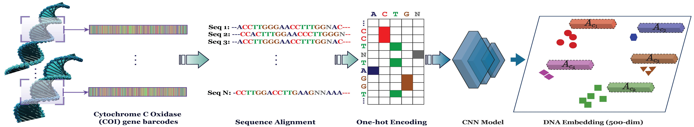

# Fine-grained ZSL with DNA as Side Information.

GitHub repo for our paper "Fine-Grained Zero-Shot Learning with DNA as SideInformation" (to appear in NeurIPS'21)

Preprint can be accessed at: [Arxiv]()

## Abstract
Fine-grained zero-shot learning task requires some form of side-information totransfer discriminative information from seen to unseen classes.  As manually annotated visual attributes are extremely costly and often impractical to obtain fora large number of classes, in this study we use DNA as side information for the first time for fine-grained zero-shot classification of species. Mitochondrial DNA plays an important role as a genetic marker in evolutionary biology and has been used to achieve near perfect accuracy in species classification of living organisms. We implement a simple hierarchical Bayesian model that uses DNA informationto establish the hierarchy in the image space and employs local priors to define surrogate classes for unseen ones. On the benchmark CUB dataset we show that DNA can be equally promising, yet in general a more accessible alternative than word vectors as a side information. This is especially important as obtaining robustword representations for fine-grained species names is not a practicable goal wheninformation about these species in free-form text is limited. On a newly compiledfine-grained insect dataset that uses DNA information from over a thousand specieswe show that the Bayesian approach outperforms state-of-the-art by a wide margin.

  

## Notes
Please see the ReadMe files inside of the relevant folders, `BZSL` and `DNA embeddings`, for the instructions to reproduce results and run experiments.

